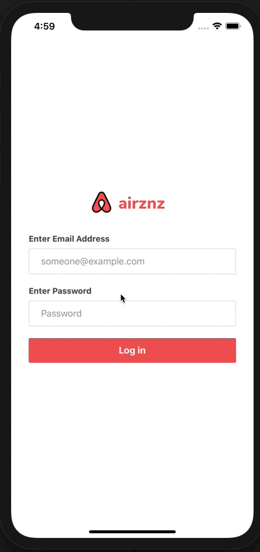

  

<h3 align="center">"AirZnz" Full-Stack JavaScript App</h3>

  
  

---

 AirZnz App Built Using Node.js + ReactNative + Expo.
      

## 📝 Table of Contents
- [About](#about)
- [Usage](#usage)
- [Authors](#authors)
- [Overview](#solutionsoverview)

## 🧐 About 
This is my attempt at creating a functional full-stack JavaScript app using React Native for the frontend, Node.js for the backend, and Expo's mobile-oriented platform. If you'd like to check out the backend portion of this project in more details, please check out <a href="https://github.com/carloswhite/lodging-booking-app">this</a> repo. 

## 🎈 Usage 
Feel free to use (or tweak it) for your own use.

## ✍️  Authors 
- [@carloswhite](https://github.com/carloswhite) - Idea & added work

## 📈 Overview
<b>More</b> Images + Videos + GIFs + Live Demo comming soon
- Login screen

